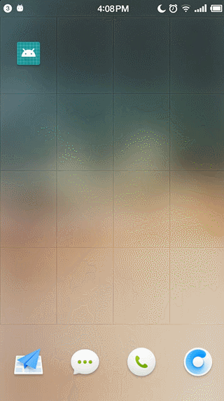
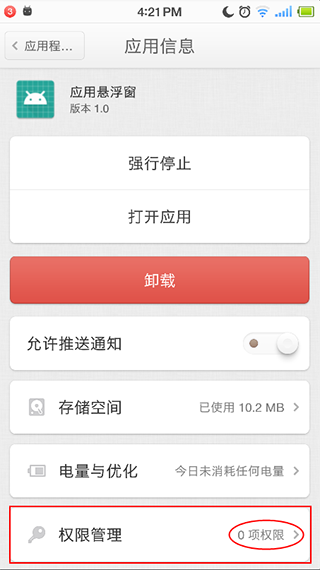

### 应用悬浮窗
> 无需权限实现应用悬浮窗

##### 悬浮窗

##### 权限

### 几个关键点
1. `type=TYPE_PHONE` 电话窗口。它用于电话交互（特别是呼入）。它置于所有应用程序之上，状态栏之下。 需要权限 `android.permission.SYSTEM_ALERT_WINDOW`
2. `type=TYPE_TOAST` 信息窗口。用于显示`toast`。 无需权限
3. 通过`bindService`开启一个`Service`,`Service`创建成功之后,拿到 `WindowManager`,再通过 `WindowManager` `addView` 的形式 实现悬浮视图的添加。 **此为关键点**
4. 浮悬窗点击事件可能无效 可以 **自定义View** 更改 `onTouchEvent` 实现悬浮视图的移动和点击事件处理。

5. `onTrimMemory(int level)` 可以判断前后台 `(level==TRIM_MEMORY_UI_HIDDEN)`

### 参考文章
- [Android无需权限显示悬浮窗, 兼谈逆向分析app](https://www.jianshu.com/p/167fd5f47d5c)